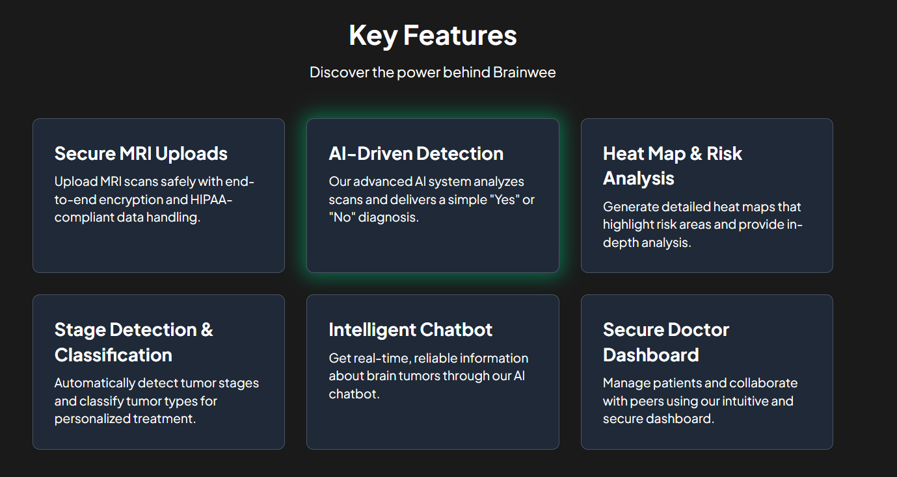

# The Axios - DIVERSION 2k25

## 🏥 Brain Tumor Segmentation using Deep Learning

### 📌 Project Overview
This project focuses on detecting and segmenting brain tumors using deep learning models. The goal is to accurately predict tumor regions in MRI scans, refine the predicted masks, and visualize them effectively.

---

## 🚀 Features
- **Deep Learning Model**: Utilizes a CNN-based approach for brain tumor segmentation.
- **Preprocessing Pipeline**: Includes image resizing, normalization, and augmentation.
- **Post-processing**: Applies Gaussian smoothing and morphological operations to refine segmentation masks.
- **Visualization**: Displays predicted masks and overlays them on MRI images.
- **Web App**: Provides a simple UI for uploading and processing MRI scans.
---


##  Homepage Preview


---
##  Key  Features Preview



---

## 📂 Folder Structure
```
├── models/              # Trained deep learning models
├── static/
│   ├── css/            # Stylesheets
│   ├── js/             # Frontend scripts
│   ├── heatmaps/       # Generated heatmaps
│   ├── images/         # UI images
├── templates/
│   ├── index.html      # Web interface
├── uploads/            # Uploaded MRI scans
├── app.py              # Main backend file (Flask-based)
├── requirements.txt    # Python dependencies
├── README.md           # Project documentation
```

---

## 🛠️ Installation & Setup

### 1️⃣ Clone the Repository
```bash
git clone https://github.com/your-username/The-Axios-BrainTumorSegmentation.git
cd The-Axios-BrainTumorSegmentation
```

### 2️⃣ Create a Virtual Environment
```bash
python -m venv venv
source venv/bin/activate  # On Windows use `venv\Scripts\activate`
```

### 3️⃣ Install Dependencies
```bash
pip install -r requirements.txt
```

### 4️⃣ Run the Application
```bash
python app.py
```
The app will be available at `http://127.0.0.1:5000/`

---


### 📊 Performance Graphs
#### Segmentation Performance


#### Classification Performance


#### Confusion Matrix


#### Segmentation Results


---

## 🤖 Technologies Used
- **Python** (TensorFlow, OpenCV, NumPy, Matplotlib, Flask)
- **Deep Learning** (CNN-based segmentation model)
- **Frontend** (HTML, CSS, JavaScript,Tailwind CSS)

---

## 📌 Future Enhancements
- Improve model accuracy with a larger dataset.
- Deploy the model using cloud services (AWS/GCP).
- Build a real-time tumor detection system.

---

## 🏆 Contributors
- **Srinjoy Pramanik** - Backend Engineer
- **Rupkatha Sharma** - Machine Learning Expert
- **Syed Md Musharraf** - Deep Learning Engineer
- **Mayukh Bhowmik** - Frontend Engineer


---

## 📝 This Project is Specially Made For DIVERSION @2025 By Team Axios
